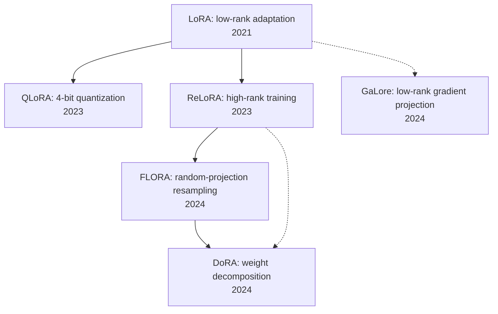

[中文](./README.md)

# paper-compass

Paper Compass | Research-paper learnpath, scoring, and roadmap skills

- `/paper-compass-learnpath`: build a prerequisite learning path before reading a paper
- `/paper-compass-score`: score a paper's value and help prioritize which papers are worth reading
- `/paper-compass-roadmap`: take a paper folder and learning goal, then generate a multi-paper reading roadmap

## 1. `paper-compass-learnpath`

- Supports `arXiv ID`, `arXiv URL`, generic paper URL, and local PDF
- Extracts the concepts you must understand first and uses `memory.md` to skip what you already know
- Anchors each concept to paper evidence and short quotes, then organizes the learnpath by dependency, difficulty, and time cost

Existing learnpath example reports:

| Paper | arXiv ID | Venue | Notes | Report |
|---|---|---|---|---|
| ReAct | 2210.03629 | ICLR 2023 | Foundational LLM-agent work | [ReAct_agent_report_en.md](./examples/learnpath/ReAct_agent_report_en.md) |
| Vision Transformer (ViT) | 2010.11929 | ICLR 2021 | 70,000+ citations | [ViT_report_en.md](./examples/learnpath/ViT_report_en.md) |
| Gated Attention | 2505.06708 | NeurIPS 2025 | Best Paper | [Gated_Attention_report_en.md](./examples/learnpath/Gated_Attention_report_en.md) |
| QLoRA | 2305.14314 | NeurIPS 2023 | 10,000+ citations | [QLoRA_report_en.md](./examples/learnpath/QLoRA_report_en.md) |

Usage:

```bash
/paper-compass-learnpath <paper-input> [memory=<path/to/memory.md>] [lang=zh|en]
```

Examples:

```bash
/paper-compass-learnpath 2010.11929
/paper-compass-learnpath ./papers/vit.pdf lang=zh
/paper-compass-learnpath 2305.14314 memory=~/Documents/know/memory.md lang=en
```

## 2. `paper-compass-score`

- Supports `arXiv ID`, `arXiv URL`, generic paper URL, and local PDF
- Scores a paper across venue quality, authors, citations, technical delta, and industry contribution
- Fetches relevant recent and classic papers from the same area for grounded comparison instead of unsupported model judgment

Existing score example reports:

| Paper | Year | Venue | Score | Notes | Report |
|---|---:|---|---:|---|---|
| Update or Wait: How to Keep Your Data Fresh | 2017 | IEEE Transactions on Information Theory | 8.5 | AoI foundational-paper value analysis | [Update_or_Wait_AoI_score_en.md](./examples/score/Update_or_Wait_AoI_score_en.md) |
| CLIP | 2021 | ICML 2021 | 10.0 | Foundational vision-language pretraining paper value analysis | [CLIP_score_en.md](./examples/score/CLIP_score_en.md) |
| Segment Anything (SAM) | 2023 | ICCV 2023 | 10.0 | Foundation segmentation-model paper value analysis | [SAM_score_en.md](./examples/score/SAM_score_en.md) |
| DeepSeekMath (GRPO) | 2024 | arXiv | 7.3 | Math-reasoning and GRPO paper value analysis | [DeepSeekMath_GRPO_score_en.md](./examples/score/DeepSeekMath_GRPO_score_en.md) |

Usage:

```bash
/paper-compass-score <paper-input> [lang=zh|en]
```

Examples:

```bash
/paper-compass-score 1706.03762
/paper-compass-score https://arxiv.org/abs/2210.03629 lang=zh
/paper-compass-score ./papers/1706.03762.pdf lang=en
```

## 3. `paper-compass-roadmap`

- Supports a paper-folder path, a natural-language learning goal, optional `memory.md`, and `lang=zh|en`
- Outputs one markdown roadmap covering reading order, dependency graph, per-paper positioning, and 2-3 extra papers worth adding
- Uses a two-stage workflow by default: lightweight scan first, then deeper reading for only 1-2 pivotal papers if needed

Illustrative roadmap graph:



Existing roadmap example reports:

| Topic | Folder | Notes | Report |
|---|---|---|---|
| LoRA learning roadmap | `peft_paper` | A practical path from LoRA basics to idea hunting | [LoRA_roadmap_en.md](./examples/roadmap/LoRA_roadmap_en.md) |

Usage:

```bash
/paper-compass-roadmap <folder-path> goal="natural-language learning goal" [memory=<path/to/memory.md>] [lang=zh|en]
```

Examples:

```bash
/paper-compass-roadmap ./papers/moe goal="I want to understand MoE routing, efficient training, and serving tradeoffs" lang=zh
/paper-compass-roadmap ./reading_set goal="Build a solid path into RLHF and GRPO" memory=~/Documents/know/memory.md lang=en
```

## Install

```bash
mkdir -p ~/.claude/skills/paper-compass-learnpath
mkdir -p ~/.claude/skills/paper-compass-score
mkdir -p ~/.claude/skills/paper-compass-roadmap
git clone https://github.com/cenzihan/paper-compass-skill.git
cp -r paper-compass-skill/skills/paper-compass-learnpath ~/.claude/skills/paper-compass-learnpath
cp -r paper-compass-skill/skills/paper-compass-score ~/.claude/skills/paper-compass-score
cp -r paper-compass-skill/skills/paper-compass-roadmap ~/.claude/skills/paper-compass-roadmap
```

Restart Claude Code after installation.

## Project Structure

```text
paper-compass/
├── README.md
├── README.en.md
├── CLAUDE.md
├── LICENSE
├── examples/
│   ├── learnpath/
│   ├── score/
│   └── roadmap/
├── papers/
└── skills/
    ├── paper-compass-learnpath/
    │   ├── SKILL.md
    │   └── references/
    ├── paper-compass-score/
    │   ├── SKILL.md
    │   └── references/
    └── paper-compass-roadmap/
        ├── SKILL.md
        └── references/
```

## License

MIT
