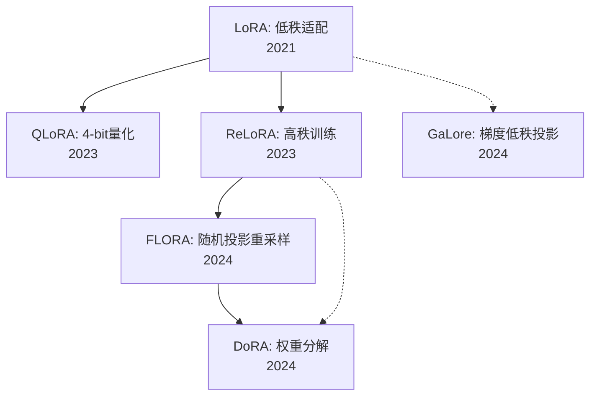

# 论文阅读路线图报告

## 0. 任务快照

- 论文文件夹: `peft_paper`
- 学习目标: 想基本了解 LoRA 的路径，后续找找有什么创新点
- 语言: zh
- memory 状态: 未加载（文件不存在）
- 论文集合状态: 5 篇已识别，全部为 LoRA 及其衍生方法

## 1. 推荐阅读顺序

| 顺序 | 论文 | 角色 | 与目标的关系 | 先修负担 | 建议动作 | 放在这里的原因 |
|---|---|---|---|---|---|---|
| 1 | **LoRA** (2106.09685) | foundation | high | low | read-first | LoRA 是 PEFT 低秩方法的起点，先理解低秩分解动机和 `W' = W + BA` 的更新形式，后面的工作才有抓手 |
| 2 | **QLoRA** (2305.14314) | bridge | high | low | read-second | 把 LoRA 与 4-bit 量化结合，先建立“冻结权重 + 低秩适配器”在极端资源约束下仍然可行的直觉 |
| 3 | **ReLoRA** (2307.05695) | bridge | high | medium | read-second | 正面回应 LoRA 的低秩限制问题，通过周期性合并与重置实现更高秩训练，是“如何增强表达能力”的关键思路 |
| 4 | **FLORA** (2402.03293) | core | high | medium | read-third | 从随机投影视角重新理解 LoRA，并提出重采样机制，是找创新点时最值得细读的一篇 |
| 5 | **GaLore** (2403.03507) | extension | high | medium | read-later | 把低秩思想移到梯度空间，更偏向训练视角而非 LoRA 主线，适合作为扩展阅读 |

## 2. 阅读链路图

## 3. 每篇论文的定位说明

### LoRA: Low-Rank Adaptation of Large Language Models (2106.09685)

- 角色: foundation
- 解决什么问题: 全参数微调成本过高，提出用低秩矩阵分解减少可训练参数
- 为什么现在读: 它定义了 LoRA 研究的共同起点，不理解这个范式就很难判断后续工作到底创新在哪
- 它为下一篇提供什么:
  - 为 QLoRA 提供结构基础
  - 为 ReLoRA 和 FLORA 提供“低秩限制”这个核心问题
- 证据:
  - arXiv 2106.09685，2021 年，LoRA 原始提出论文
  - 核心形式是把权重更新写成低秩增量

### QLoRA: Efficient Finetuning of Quantized LLMs (2305.14314)

- 角色: bridge
- 解决什么问题: 在资源受限条件下，把 LoRA 与量化结合，降低大模型微调门槛
- 为什么现在读: 它帮你理解 LoRA 为什么能成为工程上真正可用的主线方法
- 它为下一篇提供什么:
  - 验证 LoRA 可和其他高效手段叠加
  - 提供“效率优化”这一条创新分支
- 证据:
  - arXiv 2305.14314，LoRA 与 4-bit 量化结合的代表性论文
  - 展示了在有限显存下保持高性能的路径

### ReLoRA: High-Rank Training Through Low-Rank Updates (2307.05695)

- 角色: bridge
- 解决什么问题: LoRA 长期受限于固定低秩子空间，表达能力有限
- 为什么现在读: 它是“突破低秩限制”这条创新方向里最直接的一篇
- 它为下一篇提供什么:
  - 为 FLORA 提供“如何获得更高秩效果”的问题背景
  - 帮你建立“低秩更新不必永远停留在固定子空间”的思路
- 证据:
  - arXiv 2307.05695
  - 通过周期性合并和重置低秩更新，实现更高秩训练效果

### FLORA: Low-Rank Adapters Are Secretly Gradient Compressors (2402.03293)

- 角色: core
- 解决什么问题: 从随机投影和梯度压缩角度重新解释 LoRA，并提出重采样策略
- 为什么现在读: 如果你后续想找创新点，这篇最值得精读，因为它不只是改工程细节，而是换了理论视角
- 它为下一篇提供什么:
  - 给 DoRA 等后续方法提供新的分析框架
  - 帮你从“视角创新”而非“参数技巧”去想新点子
- 证据:
  - arXiv 2402.03293
  - 明确把 LoRA 与梯度压缩、随机投影联系起来

### GaLore: Memory-Efficient LLM Training by Gradient Low-Rank Projection (2403.03507)

- 角色: extension
- 解决什么问题: 把低秩思想应用到梯度空间，面向训练时内存优化
- 为什么现在读: 它不是 LoRA 主线，但能帮你看到“低秩到底该施加在哪里”这个更大的设计空间
- 它为下一篇提供什么:
  - 提供 LoRA/FLORA 之外的低秩应用方向
  - 适合作为找创新点时的对照视角
- 证据:
  - arXiv 2403.03507
  - 重点在梯度低秩投影，而不是适配器本身

## 4. 基于 memory 的个性化调整

- memory 文件不存在，无法进行个性化裁剪
- 默认假设: 用户对 LoRA 主线仍处在“基础了解”阶段，因此保留从 LoRA 原论文开始的主线

## 5. 额外建议补充阅读（2-3 篇）

| 论文 | 年份 | 链接 | 插入位置 | 为什么要补 |
|---|---:|---|---|---|
| **DoRA: Weight-Decomposed Low-Rank Adaptation** | 2024 | https://arxiv.org/abs/2402.09353 | FLORA 之后 | 权重分解视角很强，是 LoRA 系列里近年最值得对比的一条支线 |
| **LoRA+: Efficient Low Rank Adaptation of Large Models** | 2024 | https://arxiv.org/abs/2402.12354 | LoRA 之后可选插入 | 提供更细的优化视角，帮助你从“训练策略”而非“结构改动”看创新点 |

## 6. 执行建议

- 第一轮怎么读: 先按 `LoRA -> QLoRA -> ReLoRA` 建立主线，只抓核心问题、方法动机和方法差异
- 第二轮怎么读: 重点细读 FLORA，再补 DoRA，对比这些工作到底在哪一层做创新
- 哪些论文可以只 skim: 如果你目前只关心微调而不关心预训练，GaLore 可以先 skim
- 完成主线后的下一步: 把“低秩施加位置”“是否需要动态子空间”“理论视角 vs 工程优化”整理成自己的创新候选清单

## 7. **Sources**:

- [LoRA: Low-Rank Adaptation of Large Language Models](https://arxiv.org/abs/2106.09685)
- [QLoRA: Efficient Finetuning of Quantized LLMs](https://arxiv.org/abs/2305.14314)
- [ReLoRA: High-Rank Training Through Low-Rank Updates](https://arxiv.org/abs/2307.05695)
- [FLORA: Low-Rank Adapters Are Secretly Gradient Compressors](https://arxiv.org/abs/2402.03293)
- [GaLore: Memory-Efficient LLM Training by Gradient Low-Rank Projection](https://arxiv.org/abs/2403.03507)
- [DoRA: Weight-Decomposed Low-Rank Adaptation](https://arxiv.org/abs/2402.09353)
- [LoRA+: Efficient Low Rank Adaptation of Large Models](https://arxiv.org/abs/2402.12354)
