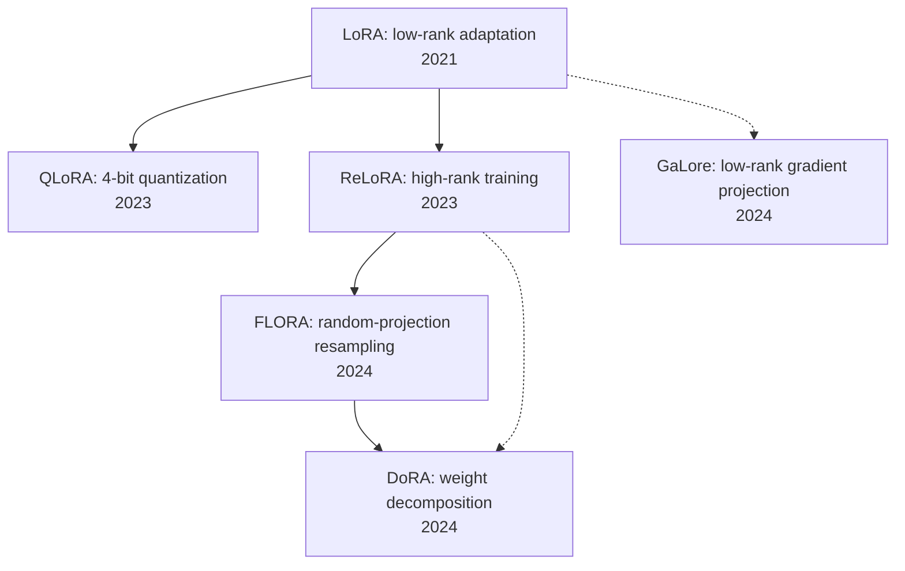

# Paper Reading Roadmap Report

## 0. Task Snapshot

- Paper folder: `peft_paper`
- Learning goal: Build a basic path for understanding LoRA first, then look for promising innovation directions
- Language: en
- Memory status: not loaded (file not found)
- Paper-set status: 5 papers identified, all centered on LoRA and closely related variants

## 1. Recommended Reading Order

| Order | Paper | Role | Goal Relevance | Prerequisite Load | Suggested Action | Why It Appears Here |
|---|---|---|---|---|---|---|
| 1 | **LoRA** (2106.09685) | foundation | high | low | read-first | LoRA is the starting point of the whole PEFT low-rank line. Without it, the later variants are hard to evaluate meaningfully. |
| 2 | **QLoRA** (2305.14314) | bridge | high | low | read-second | It shows how LoRA becomes practically dominant under strong memory constraints, which gives the main engineering intuition. |
| 3 | **ReLoRA** (2307.05695) | bridge | high | medium | read-second | It directly addresses the fixed low-rank limitation and opens the “how do we go beyond LoRA’s rank bottleneck?” branch. |
| 4 | **FLORA** (2402.03293) | core | high | medium | read-third | This is the most valuable paper for finding new ideas because it reframes LoRA through random projection and gradient compression. |
| 5 | **GaLore** (2403.03507) | extension | high | medium | read-later | It extends low-rank thinking into gradient space, which is useful for broadening the innovation space rather than mastering the LoRA mainline itself. |

## 2. Roadmap Graph

## 3. Per-Paper Positioning

### LoRA: Low-Rank Adaptation of Large Language Models (2106.09685)

- Role: foundation
- Problem it addresses: full-parameter finetuning is too expensive, so it replaces dense updates with low-rank updates
- Why read it now: it defines the common language, assumptions, and baseline mechanism for nearly all later LoRA-style work
- What it unlocks next:
  - the structural basis behind QLoRA
  - the rank-limitation problem attacked by ReLoRA and FLORA
- Evidence:
  - arXiv 2106.09685, the original LoRA paper
  - the core update is expressed as a low-rank increment on frozen weights

### QLoRA: Efficient Finetuning of Quantized LLMs (2305.14314)

- Role: bridge
- Problem it addresses: how to make LoRA practical under strict memory constraints by combining it with quantization
- Why read it now: it explains why LoRA became a dominant practical path rather than just an elegant parameterization idea
- What it unlocks next:
  - confidence that LoRA composes well with other efficiency techniques
  - the efficiency-oriented innovation branch
- Evidence:
  - arXiv 2305.14314
  - a representative demonstration that LoRA plus 4-bit quantization remains highly effective

### ReLoRA: High-Rank Training Through Low-Rank Updates (2307.05695)

- Role: bridge
- Problem it addresses: fixed low-rank updates constrain the search space and can limit expressivity
- Why read it now: it is one of the clearest papers if your question is “how can we go beyond LoRA’s low-rank bottleneck?”
- What it unlocks next:
  - the motivation behind FLORA
  - a broader intuition that low-rank updates do not need to stay in one static subspace forever
- Evidence:
  - arXiv 2307.05695
  - periodically merges and resets LoRA updates to realize higher-rank training behavior

### FLORA: Low-Rank Adapters Are Secretly Gradient Compressors (2402.03293)

- Role: core
- Problem it addresses: it reinterprets LoRA through random projection and gradient compression, then introduces resampling
- Why read it now: among this set, it is the strongest paper for innovation hunting because it changes the theoretical lens rather than only tuning the recipe
- What it unlocks next:
  - a new analytical frame for later variants like DoRA
  - a path to think in terms of viewpoint innovation, not just parameter tricks
- Evidence:
  - arXiv 2402.03293
  - explicitly connects LoRA to random projection and gradient compression

### GaLore: Memory-Efficient LLM Training by Gradient Low-Rank Projection (2403.03507)

- Role: extension
- Problem it addresses: it applies low-rank projection to gradients rather than adapter weights
- Why read it now: it is not the LoRA mainline, but it broadens the question into “where should low rank actually be imposed?”
- What it unlocks next:
  - a contrasting direction beyond LoRA and FLORA
  - a more general innovation space around low-rank structure
- Evidence:
  - arXiv 2403.03507
  - focuses on low-rank gradient projection instead of adapter-only design

## 4. Personalized Adjustments From memory

- No memory file was available, so no personalized pruning was applied
- Default assumption: the user is still at the “basic understanding” stage for LoRA, so the roadmap keeps the original paper as the entry point

## 5. Additional Papers To Add (2-3 max)

| Paper | Year | Link | Insert Position | Why Add It |
|---|---:|---|---|---|
| **DoRA: Weight-Decomposed Low-Rank Adaptation** | 2024 | https://arxiv.org/abs/2402.09353 | after FLORA | One of the strongest recent LoRA-adjacent branches, with a clean and influential decomposition-based perspective |
| **LoRA+: Efficient Low Rank Adaptation of Large Models** | 2024 | https://arxiv.org/abs/2402.12354 | optionally after LoRA | Useful if you want to think about optimization strategy as an innovation axis rather than only changing structure |

## 6. Execution Advice

- How to do pass 1: read `LoRA -> QLoRA -> ReLoRA` first and focus only on the problem, motivation, and what each paper changes
- How to do pass 2: read FLORA carefully, then add DoRA, and compare which papers innovate through theory, which through training strategy, and which through parameterization
- Which papers can be skimmed: if you mainly care about finetuning instead of pretraining, GaLore can stay at skim level for now
- Best next step after the main path: organize your idea search around three axes: where low rank is applied, whether the subspace should stay fixed, and whether the gain comes from theory or engineering

## 7. **Sources**:

- [LoRA: Low-Rank Adaptation of Large Language Models](https://arxiv.org/abs/2106.09685)
- [QLoRA: Efficient Finetuning of Quantized LLMs](https://arxiv.org/abs/2305.14314)
- [ReLoRA: High-Rank Training Through Low-Rank Updates](https://arxiv.org/abs/2307.05695)
- [FLORA: Low-Rank Adapters Are Secretly Gradient Compressors](https://arxiv.org/abs/2402.03293)
- [GaLore: Memory-Efficient LLM Training by Gradient Low-Rank Projection](https://arxiv.org/abs/2403.03507)
- [DoRA: Weight-Decomposed Low-Rank Adaptation](https://arxiv.org/abs/2402.09353)
- [LoRA+: Efficient Low Rank Adaptation of Large Models](https://arxiv.org/abs/2402.12354)
