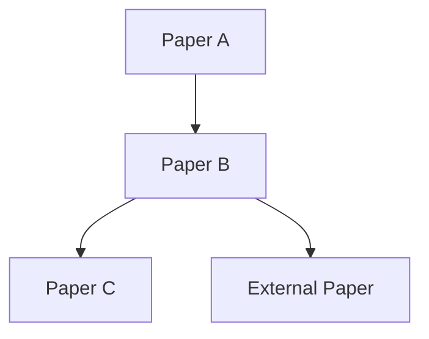

# Paper-Compass-Roadmap

Do one thing: turn a folder of papers into a goal-oriented reading roadmap.

## Language Interface

- Supported parameter: `lang=zh|en`
- Default output language: `zh`
- If `lang=en`, output the full report in English.
- If `lang=zh`, output all report sections in Chinese.
- Keep technical terms unchanged when translation would reduce precision.

## Supported Input Shape

Use this skill when the user provides:

- a paper folder path
- a natural-language learning goal
- optional `memory=<path/to/memory.md>`
- optional `lang=zh|en`

Recommended invocation form:

```bash
/paper-compass-roadmap <folder-path> goal="natural-language learning goal" [memory=<path/to/memory.md>] [lang=zh|en]
```

Examples:

```bash
/paper-compass-roadmap ./papers/moe goal="I want to understand MoE routing, efficient training, and serving tradeoffs" lang=zh
/paper-compass-roadmap ./reading_set goal="Build a solid path into RLHF and GRPO" memory=~/Documents/know/memory.md lang=en
```

## Constraints

### C0: Folder Scope First

- The user-provided folder is the primary reading set.
- Build the main path from papers inside that folder first.
- External expansion papers are supplements, not replacements.
- External papers must be limited to `2-3` items total.

### C1: Goal-Oriented Ordering

- Reading order must be derived from the user's learning goal, not just publication date or citation count.
- For each paper in the folder, explain:
  - why it appears at that stage
  - what prerequisite value it provides
  - what downstream papers it unlocks
- Prefer an executable chain:
  - foundation
  - bridge
  - target-focus
  - frontier or optional extension

### C2: Memory-Aware Personalization

- If user provides `memory=<path>`, read it first.
- If not provided, try `~/Documents/know/memory.md`.
- If the file does not exist, continue and mark memory as not loaded.
- Use memory only to adjust reading order, refresh depth, and expansion suggestions.
- Do not silently drop an essential paper only because a topic is familiar.

### C3: Evidence and Honesty

- Every paper-order decision must be justified with evidence from one or more of:
  - paper abstract
  - paper sections
  - venue / citation metadata
  - overlap with the user's goal
- If a paper cannot be parsed well enough, keep it in the candidate set only with `insufficient information` / `信息不足`.
- Never fabricate metadata, dependencies, or external-paper relevance.

### C4: Two-Stage Context Control Is Mandatory

- Folder mode MUST use a two-stage process.
- Stage 1 is lightweight scanning only:
  - file name
  - title
  - abstract or TLDR
  - first page if needed
  - arXiv / Semantic Scholar / OpenAlex metadata
- Stage 1 MUST NOT read every PDF in full.
- NEVER inline or read the complete content of all papers in the folder.
- For folders with more than 3 papers, treat full-document reading as exceptional, not default.
- Stage 2 may do deeper reading for at most `1-2` papers total.
- Stage 2 deeper reading is allowed only when:
  - the main ordering remains ambiguous after Stage 1, or
  - one pivotal paper must be inspected to understand a dependency edge.
- External expansion papers are metadata-only by default:
  - do not read their full text
  - use title, abstract, venue, citation, and short summary only
- If the context budget looks risky, prefer shallower evidence over request failure.

### C5: Output Is One Markdown File

- Final output must be exactly one markdown report.
- The report must include:
  - a recommended reading order
  - a dependency-style roadmap graph
  - per-paper rationale
  - optional external papers
  - a concise execution plan

### C6: Independent Interface, Shared Logic

- This skill is independent and user-invocable on its own.
- But it should reuse the spirit of:
  - `paper-compass-learnpath` for prerequisite and memory reasoning
  - `paper-compass-score` for priority and value judgment
- Do not output full single-paper learnpath or full score reports here.
- Instead, output concise paper-level role labels such as:
  - `foundation`
  - `bridge`
  - `core`
  - `extension`

### C7: Output Structure Is Fixed

- Read the selected template before writing.
- Keep the section order exactly as the template defines.
- `## 7. **Sources**:` must always be present.

## Input Normalization

### Folder Handling

- Accept folder paths that contain:
  - local PDF files
  - markdown notes with paper URLs
  - text files with URLs, arXiv IDs, or titles
- Prefer PDFs when available.
- If multiple formats exist for the same paper, prefer:
  - PDF
  - direct arXiv URL / DOI URL
  - title-only notes

### Supported Per-Paper Inputs Inside the Folder

| Item found in folder | Rule |
|---|---|
| `*.pdf` | Treat as primary paper source |
| `*.md` / `*.txt` with arXiv or DOI URL | Extract URL and resolve metadata |
| `*.md` / `*.txt` with a paper title | Use title search to resolve metadata |
| duplicated versions of same paper | Deduplicate by title + authors + year where possible |

## Workflow

### Step 1: Enumerate and Normalize the Folder

List all candidate files in the given folder.

Build a normalized paper list with:

- local source path
- detected title
- arXiv ID if available
- DOI if available
- URL if available
- parse confidence

Deduplicate obvious duplicates.

### Step 2: Stage 1 Lightweight Scan Only

For each paper candidate, gather enough information to rank and place it:

- title
- authors
- year
- venue if available
- citation count if available
- abstract or TLDR
- method/problem keywords

Preferred retrieval order:

1. local PDF text or first-page extraction
2. arXiv API when arXiv ID exists
3. Semantic Scholar or `/semantic-scholar` for title/venue/citation lookup
4. OpenAlex as a citation or DOI cross-check

Hard limits for Stage 1:

- NEVER read all PDFs in the folder in full.
- Prefer file name, first page, abstract, TLDR, and metadata.
- If a local PDF is large, do not ingest the entire document just to rank it.
- Abstract-level understanding is the default and is usually enough for ordering.
- Only store compact notes per paper, not long excerpts.

### Step 3: Parse Goal and Memory

Extract from the learning goal:

- target topic
- target capability
- desired depth
- implicit constraints such as:
  - implementation focus
  - theory focus
  - systems focus
  - survey-first preference

If memory is present, classify mentioned concepts into:

- mastered
- familiar
- basic
- unknown

Default missing items to `unknown`.

### Step 4: Assign a Role to Each Paper

Assign one primary role:

- `foundation`: introduces the core concepts the rest depends on
- `bridge`: connects foundations to the goal-specific method stack
- `core`: directly serves the user's stated learning goal
- `extension`: useful after the main path or only for deeper exploration

For each paper also estimate:

- relevance to goal: `high / medium / low`
- prerequisite load: `low / medium / high`
- recommended action:
  - `read-first`
  - `read-second`
  - `read-later`
  - `skim-only`

### Step 5: Stage 2 Targeted Deep Reading For 1-2 Papers Max

After Stage 1, ask whether deeper reading is actually needed.

Deeper reading is optional, not mandatory.

Only inspect at most `1-2` papers more deeply, and only if one of these is true:

- two or more papers compete for the same position in the chain
- a dependency edge is unclear from abstract-level evidence
- one central paper appears to define terminology needed by several others

When doing deeper reading:

- prefer the introduction, method overview, and conclusion first
- avoid full-document ingestion when a few sections are enough
- do not deeply read external expansion papers

### Step 6: Build the Reading Chain

Construct an ordered chain across the folder papers.

Ordering principles:

1. reduce prerequisite jumps
2. maximize support for the stated goal
3. avoid reading two papers in a row with nearly identical contribution unless comparison is useful
4. if two papers are parallel branches, say so explicitly

For every edge in the chain, explain the dependency:

- concept dependency
- method dependency
- benchmark dependency
- motivation dependency

### Step 7: Recommend 2-3 External Papers

Only add external papers when they clearly fill a gap.

Allowed reasons:

- missing foundation not covered in the folder
- crucial bridge paper absent from the folder
- canonical paper needed to interpret terminology or benchmark context

Each external paper must include:

- title
- link
- year
- one-sentence reason for inclusion
- where it fits in the order

Limit: `2-3` papers total.

External-paper retrieval rule:

- metadata-only by default
- do not read full PDFs unless the user later asks for a dedicated single-paper analysis

### Step 8: Generate a Roadmap Graph

The markdown report must include a compact graph representation.

Preferred format:

````md

````

If Mermaid is not appropriate, fall back to a text graph:

```text
Paper A -> Paper B -> Paper C
             |
             +-> External Paper
```

### Step 9: Generate the Report

Select template by language:

- `lang=zh` -> `references/template.zh.md`
- `lang=en` -> `references/template.en.md`
- fallback -> `references/template.md`

Write:

- File name: `{timestamp}--paper-compass-roadmap-{goal-short-name}__roadmap.md`
- Path: current working directory (`./`)

After writing, report the absolute output path.

## Output Quality Checklist

- Every input paper is either placed in the roadmap or explicitly marked low-priority.
- Reading order is justified by the user's goal, not by superficial metrics alone.
- Memory changes the path only where it should.
- External papers are limited to 2-3 and each has a clear reason.
- The workflow stayed two-stage and did not fully ingest the whole folder.
- The graph and the ordered list are consistent with each other.
- The report stays concise enough to act on immediately.
